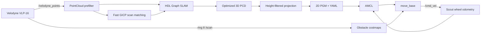

# SCOUT 3D SLAM & 2D Navigation

Scout V2와 Velodyne VLP-16으로 **3D 지도를 작성하고, 이를 2D occupancy map으로 변환해 자율주행하는 ROS 1 프로젝트**입니다.

Jetson에서 `hdl_graph_slam`과 Fast GICP로 3D SLAM을 수행하고, 생성된 PCD를 높이 구간으로 투영해 PGM/YAML 지도를 만듭니다. 주행 단계에서는 Scout 휠 오도메트리, Velodyne 단일 ring LaserScan, AMCL, `move_base`, DWA Local Planner를 사용합니다.

> 실제 Scout에서 3D 매핑, 지도 변환, 위치 추정, 연속 목표 주행, 좁은 통로 통과, 좌·우회전 및 목표 자세 정렬까지 검증한 설정입니다.


## 주요 기능

- Velodyne VLP-16 PointCloud와 Fast GICP 기반 3D scan-matching odometry
- `hdl_graph_slam` pose graph 및 loop closure 기반 3D 지도 작성
- 최적화된 PCD에서 장애물 높이만 추출하는 2D occupancy map 변환
- Scout 휠 오도메트리와 AMCL 기반 2D 위치 추정
- VLP-16 ring 8을 `/scan`으로 변환해 실시간 장애물 costmap 구성
- `move_base` + NavFn + DWA 기반 실내 자율주행
- 매핑과 Navigation 모드별 TF publisher 분리로 중복 TF 방지
- Scout가 실제로 반응하는 최저 속도를 고려한 DWA 파라미터 적용

## 시스템 구성

| 구분 | 구성 |
|---|---|
| Mobile base | AgileX Scout V2 |
| 3D LiDAR | Velodyne VLP-16 |
| Computer / OS | NVIDIA Jetson (aarch64) / Ubuntu 20.04 |
| Middleware | ROS 1 Noetic |
| 3D SLAM / Registration | HDL Graph SLAM / Fast GICP |
| Localization | AMCL + Scout wheel odometry |
| Planning | NavFn + DWA Local Planner |
| Map format | PCD → PGM + YAML |

검증된 장비 설정:

```text
Velodyne sensor IP : 192.168.10.202
Jetson eth0 IP     : 192.168.10.102/24
UDP data port      : 2369

base_link -> velodyne
x=0.34, y=0.0, z=0.185
roll=0.0, pitch=0.0, yaw=0.0
```

장비가 다르면 launch argument로 반드시 변경해야 합니다.

## 데이터 흐름



### Mapping TF

```text
map ── odom ── base_link ── velodyne
 │       │          │
 │       │          └─ static transform
 │       └─ scan_matching_odometry
 └─ hdl_graph_slam map2odom publisher
```

매핑 중 Scout 휠 오도메트리는 `/scout_odom`으로만 발행하고 TF는 내보내지 않습니다. `/odom`과 `odom -> base_link`는 LiDAR scan matching이 단독으로 소유합니다.

### Navigation TF

```text
map ── odom ── base_link ── velodyne
 │       │          │
 │       │          └─ static transform
 │       └─ Scout wheel odometry
 └─ AMCL
```

Navigation 중에는 `hdl_graph_slam`을 종료합니다. Scout 드라이버가 `/odom`과 `odom -> base_link`를 발행하고 AMCL이 `map -> odom`을 담당합니다.

## 저장소 구조

```text
SCOUT-3D-SLAM-2D-Navigation/
├── src/
│   ├── scout_slam_demo/       프로젝트 launch, 파라미터, RViz, 지도
│   ├── pointcloud_to_2dmap/   PCD → PGM/YAML 변환 도구
│   ├── hdl_graph_slam/        3D graph SLAM
│   ├── fast_gicp/             PointCloud registration
│   └── ndt_omp/               SLAM registration dependency
├── docs/
│   ├── SETUP.md               장비·네트워크·빌드
│   ├── MAPPING.md             3D 매핑 및 2D 지도 생성
│   ├── NAVIGATION.md          AMCL 및 자율주행
│   └── TROUBLESHOOTING.md     증상별 점검 방법
└── .gitignore
```

`scout_slam_demo`가 이 저장소의 통합 계층입니다. `hdl_graph_slam`, `fast_gicp`, `ndt_omp`는 각 원저작자의 오픈소스 프로젝트이며 라이선스와 원본 README를 유지합니다.

## 빠른 시작

### 1. 설치 및 빌드

```bash
source /opt/ros/noetic/setup.bash
git clone https://github.com/jk2001-king/SCOUT-3D-SLAM-2D-Navigation.git ~/jung_ws
cd ~/jung_ws

sudo apt update
sudo apt install -y \
  build-essential cmake python3-catkin-tools python3-rosdep \
  ros-noetic-navigation ros-noetic-dwa-local-planner \
  ros-noetic-velodyne ros-noetic-pcl-ros \
  ros-noetic-geodesy ros-noetic-nmea-msgs \
  ros-noetic-libg2o libpcl-dev libopencv-dev libboost-program-options-dev

source ~/scout/devel/setup.bash
catkin init
catkin config --extend ~/scout/devel
rosdep install --from-paths src --ignore-src -r -y
catkin build
source devel/setup.bash
```

Scout 드라이버와 URDF 패키지는 별도 워크스페이스의 `scout_base`, `scout_description`을 사용합니다. 상세 내용은 [환경 설정 및 빌드](docs/SETUP.md)를 참고하세요.

### 2. Velodyne 네트워크

```bash
sudo ip addr replace 192.168.10.102/24 dev eth0
sudo ip link set eth0 up
ip -br addr show eth0
```

### 3. 하드웨어 점검

```bash
cd ~/jung_ws
source devel/setup.bash
roslaunch scout_slam_demo hardware_3d.launch
```

```bash
rostopic hz /velodyne_points
rostopic hz /odom
rostopic info /cmd_vel
rosrun tf tf_echo odom base_link
rosrun tf tf_echo base_link velodyne
```

### 4. 3D 매핑

```bash
roslaunch scout_slam_demo mapping_3d.launch
```

지도 저장과 변환은 [3D Mapping 및 2D 지도 생성](docs/MAPPING.md)을 참고하세요.

### 5. 2D Navigation

```bash
roslaunch scout_slam_demo navigation_2d.launch
```

기본 지도는 `maps/hit_2d/map.yaml`입니다. 다른 지도를 사용할 때는:

```bash
roslaunch scout_slam_demo navigation_2d.launch \
  map_file:=$(rospack find scout_slam_demo)/maps/demo_2d/map.yaml
```

RViz에서 `2D Pose Estimate`로 초기 자세를 지정한 뒤 `2D Nav Goal`을 설정합니다.

## 검증된 토픽

| 토픽 | 역할 | 정상 주기 |
|---|---|---:|
| `/velodyne_points` | VLP-16 원본 PointCloud | 약 10 Hz |
| `/filtered_points` | SLAM 전처리 PointCloud | 약 10 Hz |
| `/odom` | 현재 모드의 odometry | 매핑 약 10 Hz / 주행 약 50 Hz |
| `/scout_odom` | 매핑 중 Scout 휠 odometry | 약 50 Hz |
| `/hdl_graph_slam/map_points` | 최적화된 누적 3D 지도 | 약 0.2 Hz |
| `/scan` | Navigation용 ring LaserScan | 약 10 Hz |
| `/cmd_vel` | Scout 속도 명령 | Navigation 중 가변 |

## 안전 주의사항

- 첫 시험은 넓고 평평하며 사람이 없는 공간에서 진행합니다.
- 리모컨과 비상정지를 즉시 사용할 수 있는 상태를 유지합니다.
- 매핑과 Navigation launch를 동시에 실행하지 않습니다.
- 새 환경에서는 낮은 속도로 TF, odometry, costmap을 먼저 검증합니다.
- footprint와 센서 TF가 실제 차체 및 장착 위치와 맞는지 확인합니다.

## 문서

- [환경 설정 및 빌드](docs/SETUP.md)
- [3D Mapping 및 2D 지도 생성](docs/MAPPING.md)
- [2D Navigation](docs/NAVIGATION.md)
- [문제 해결](docs/TROUBLESHOOTING.md)

## 주요 외부 프로젝트

- [koide3/hdl_graph_slam](https://github.com/koide3/hdl_graph_slam)
- [SMRT-AIST/fast_gicp](https://github.com/SMRT-AIST/fast_gicp)
- [koide3/ndt_omp](https://github.com/koide3/ndt_omp)
- [ros-drivers/velodyne](https://github.com/ros-drivers/velodyne)
- AgileX Scout ROS driver and description packages

각 외부 프로젝트의 저작권과 라이선스는 해당 디렉터리의 `LICENSE` 및 원본 문서를 따릅니다.
